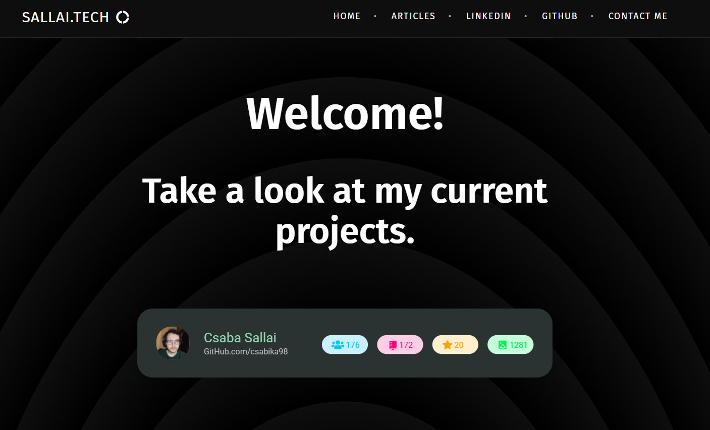
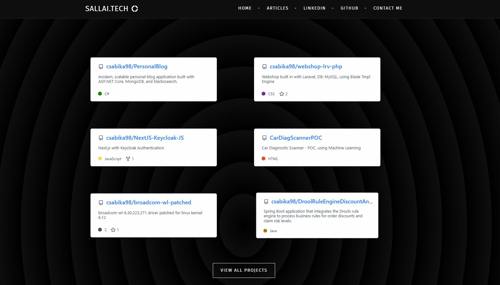
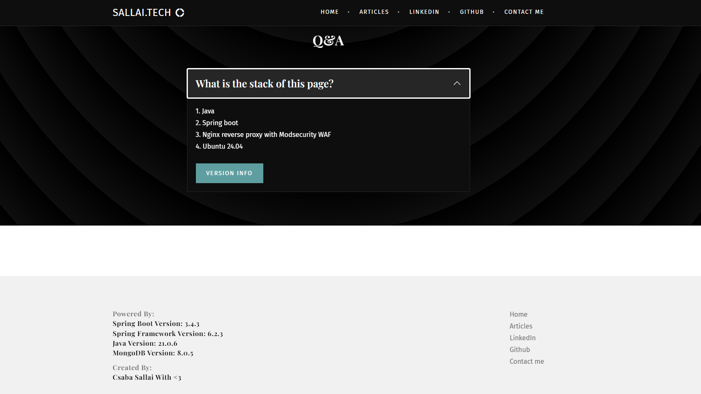
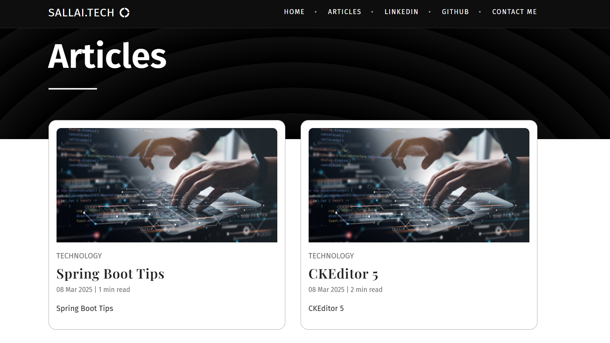
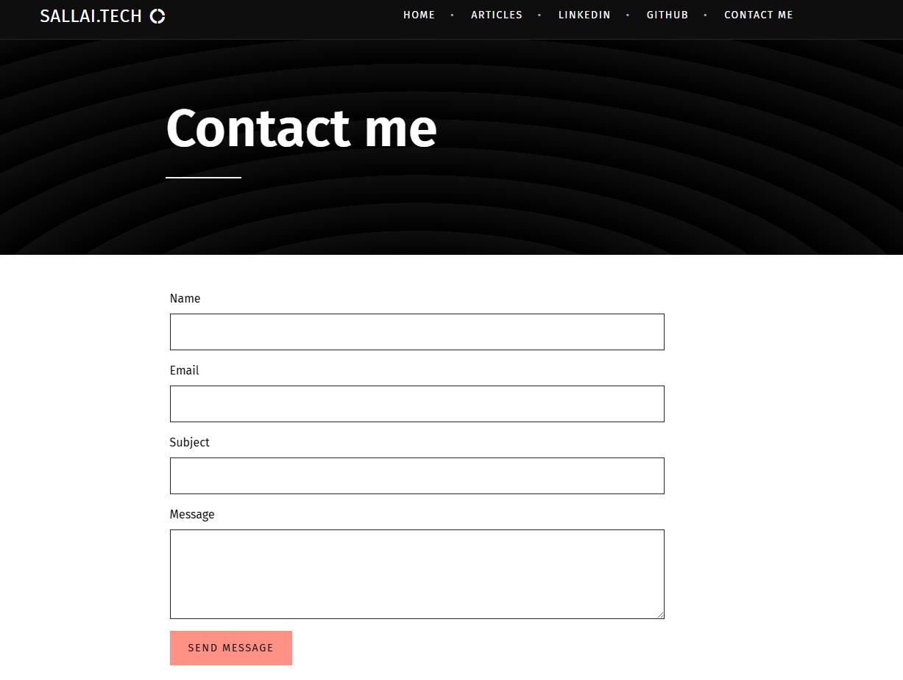

# Blog Application with Admin Panel & Markdown Support  
**Powering [sallai.tech](https://sallai.tech)**  

  
*Active development shown by real commits:*  
  
  

## ✨ Key Features  

### 🖥️ Admin Panel  
- Full CRUD operations for blog management  
- Role-based access control (Admin/User roles)  
- Dashboard with activity metrics  

### 📝 Content Management  
- **Markdown support** - Write posts in `.md` files and upload directly  
- Drag-and-drop media uploads  
- Scheduled publishing  

### 👥 User System  
- Secure registration & authentication  
- Profile management  
- Commenting system  

### 🚀 Technical Highlights  
- Java Spring Boot backend  
- MongoDB database  
- Thymeleaf + Bootstrap frontend  
- Responsive mobile-ready UI  

---

## 📸 Application Screenshots  


### 1

### 2

### 3

### 4

### 5

### 6

### 7

### 8

### 9

---

## 🛠️ Technical Stack  

**Backend**  
- Java 17  
- Spring Boot 3.x  
- Spring Security  
- Spring Data MongoDB  

**Frontend**  
- Thymeleaf templates  
- Bootstrap 5  
- Vanilla JS + jQuery  

**Database**  
- MongoDB Atlas  

**Infrastructure**  
- Docker containerization  
- CI/CD pipeline  

---

## 🔐 Security Features  

- Role-based authorization  
- CSRF protection  
- Password encryption (BCrypt)  
- Secure session management  
- Input sanitization for XSS prevention  

---

## 📂 Project Structure  
```
com.csabika98.blog/

├── config/
├── controllers/
│ ├── AdminController.java
│ ├── ApiController.java
│ └── ...
├── models/ 
├── repositories/ 
├── services/
├── util/ 
└── resources/
├── templates/ 
├── static/
└── application.properties
```


---

## 🔌 API Endpoints  

### Public Routes  
| Method | Path          | Description          |
|--------|---------------|----------------------|
| GET    | /             | Homepage with posts  |
| GET    | /posts/{slug} | Single post view     |
| POST   | /contact      | Submit contact form  |

### Admin Routes  
| Method | Path            | Description            |
|--------|-----------------|------------------------|
| POST   | /admin/posts    | Create new post        |
| PUT    | /admin/posts/{id} | Update post           |
| GET    | /admin/dashboard | Management console    |

### Authentication  
| Method | Path       | Description          |
|--------|------------|----------------------|
| POST   | /register  | User registration    |
| POST   | /login     | User login           |
| POST   | /logout    | Session termination  |

---

## 🚀 Getting Started  

*Note: Source currently private while in active production use*  

1. **Prerequisites**:  
   - Java 17 JDK  
   - MongoDB 6.0+  
   - Maven 3.8+  

2. **Configuration**:  
Create application.properties with:  
``` 
spring.data.mongodb.uri=mongodb://localhost:27017/blogdb
spring.security.user.name=admin
spring.security.user.password=securepassword
```


3. **Running**:  
```bash
mvn spring-boot:run
```

📬 Contact
For access requests or questions:

Email: sallcsa.csaba8@gmail.com

Website: sallai.tech
